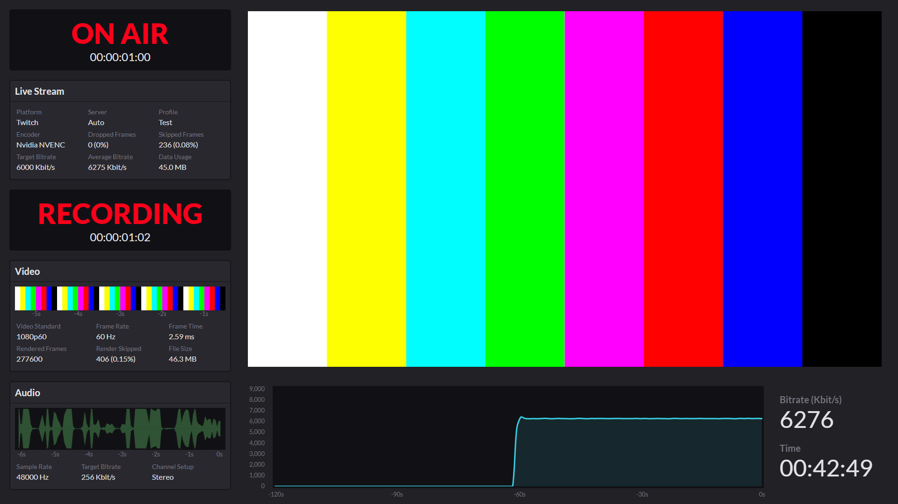
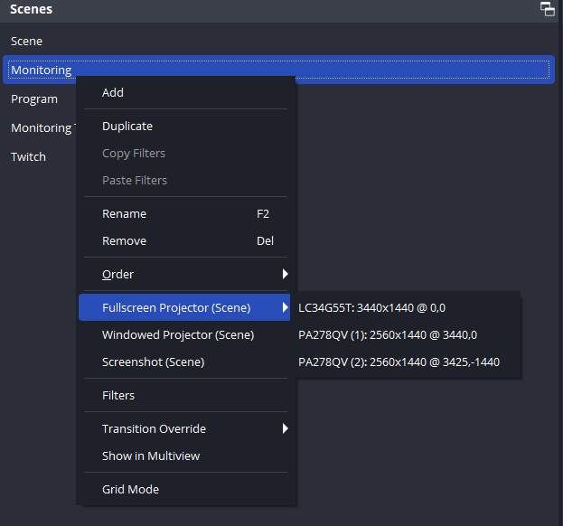

# OBS Dashboard

OBS Dashboard is an advanced monitoring dashboard for OBS Studio, providing real-time data on streaming and recording performance without requiring any plugins.



## Features

- Real-time bitrate monitoring
- Frame rate display and skipped frames indicator
- Audio level visualization
- Data usage tracking
- Separate monitoring for streaming and recording statuses

## Installation

Follow these steps to install the demo scene collection:

1. **Download the Repository**:
    - Clone or download this repository to your local machine.

2. **Import Scene Collection**:
    - Import and open the `Dashboard_Demo.json` scene collection in OBS Studio.

3. **Enable Virtual Camera**:
    - Enable the virtual camera with the Output set to "Program". This loops the program signal back to OBS.
    - If you prefer not to use the virtual camera, you can use a video signal from Twitch. Ensure you update the channel in the properties of the Browser Source accordingly.

4. **Enable Websocket Server**:
    - Navigate to `Tools > Websocket Server Settings` in OBS Studio and enable the websocket server.
    - Copy the password for the websocket server.

5. **Configure Monitoring Browser**:
    - Open the properties of `Monitoring > Monitoring Browser` and paste the websocket password under custom CSS.

## Usage

To use the dashboard, open it as a fullscreen projector. Here is an example screenshot showing the projector menu:



## Example Configuration

Below is an example configuration for the dashboard's custom CSS:

```css
:root {
    --address: 'ws://127.0.0.1:4455'; /* OBS Websocket address */
    --password: 'password'; /* OBS Websocket password */
    --screenshot: 'Program'; /* Source to use for Video timeline */
}
```